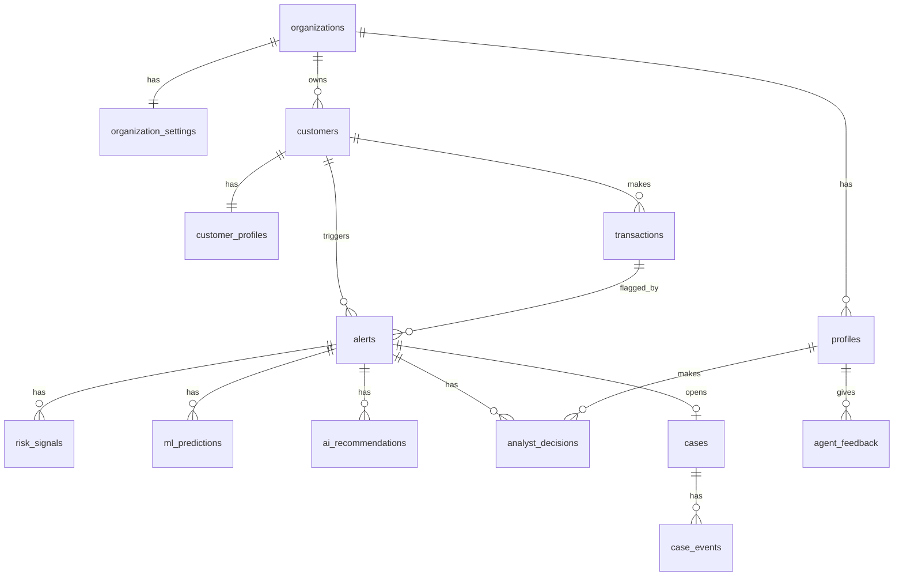

# Database Architecture

This document covers the database, authentication, and multi-tenancy
foundation implemented on `feature/supabase-schema`. It does **not** cover
the ML engine, Claude investigation logic, Hermes runtime, n8n workflows, or
the dashboard — those are owned by other feature branches and layer on top
of what's described here.

## Stack

- **Supabase** (Postgres 15 + Supabase Auth) as the database and identity
  provider.
- **Row Level Security (RLS)** as the sole enforcement mechanism for
  multi-tenancy and role permissions — never the application layer alone.
- Plain SQL migrations under `supabase/migrations/`, applied in filename
  (timestamp) order.

## Entity overview



Every tenant-owned table carries `organization_id`. `model_versions` is the
one exception: `organization_id` is nullable there, representing a
platform-wide model (`null`) alongside optionally tenant-specific ones.

## Tables

| Domain | Tables |
| --- | --- |
| Organizations | `organizations`, `organization_settings` |
| Users | `profiles` (1:1 with `auth.users`) |
| Customers | `customers`, `customer_profiles` |
| Transactions | `transactions` |
| AML/Fraud | `alerts`, `risk_signals`, `ml_predictions` |
| Investigation | `ai_recommendations`, `analyst_decisions` |
| Cases | `cases`, `case_events` |
| Audit | `audit_logs` |
| Hermes | `agent_memory`, `agent_skills`, `agent_feedback` |
| Governance | `model_versions`, `rule_versions` |
| Notifications | `notifications` |

Full column definitions live in the migrations themselves
(`supabase/migrations/`), each with a comment where the intent isn't obvious
from the DDL.

## Authentication & profiles

- `auth.users` (Supabase Auth) is the identity of record. `public.profiles`
  is a 1:1 application record (`organization_id`, `role`, `full_name`, etc.).
- A `handle_new_user()` trigger on `auth.users` auto-creates the matching
  `profiles` row on signup. `organization_id`/`role` can be seeded from
  signup metadata (an invite flow); otherwise the user starts with
  `organization_id = null` until they join or create one.
- `create_organization_with_admin(org_name, org_slug)` is a `SECURITY
  DEFINER` RPC that lets a user with no organization create one and become
  its `ADMIN` — this is the only way `organization_id` can be set on a
  profile after signup. A plain `UPDATE` can never change a profile's
  `organization_id`, by anyone, including an `ADMIN` — see "Tenant isolation
  hardening" below for why.

## Roles

`ADMIN`, `COMPLIANCE_MANAGER`, `ANALYST`, `VIEWER` (the `user_role` enum).
General pattern enforced via RLS:

- **VIEWER**: read-only across the organization.
- **ANALYST**: read everything in the org; can create records (alerts,
  decisions, cases, feedback) and update alerts/cases that are unassigned or
  assigned to them.
- **COMPLIANCE_MANAGER**: like ANALYST plus unrestricted update access to
  alerts/cases/transactions and governance tables (`model_versions`,
  `rule_versions`, `agent_skills`).
- **ADMIN**: everything COMPLIANCE_MANAGER can do, plus deleting records and
  managing organization/profile settings.

Some tables intentionally have **no UPDATE policy at all** (immutable by
design, for any role): `transactions`, `risk_signals`, `ml_predictions`,
`ai_recommendations`, `analyst_decisions`, `case_events`, `agent_feedback`,
and — most importantly — `audit_logs`, which additionally has no DELETE
policy either. A correction to any of these is a new row, not an edit.

## Row Level Security & multi-tenancy

Every policy is built on a small set of `SECURITY DEFINER` helper functions
(`supabase/migrations/20250101000006_auth_helper_functions.sql`):

- `current_org_id()` — the calling user's organization.
- `current_user_role()` — the calling user's role.
- `has_any_role(role[])` — role check helper.

They're `SECURITY DEFINER` with a pinned `search_path` so they can safely be
called from inside policies on `profiles` itself without infinite RLS
recursion. The standard shape of a table's policies:

```sql
alter table public.<table> enable row level security;

create policy <table>_select on public.<table>
  for select using (organization_id = current_org_id());

create policy <table>_insert on public.<table>
  for insert with check (
    organization_id = current_org_id()
    and has_any_role(array['ADMIN','COMPLIANCE_MANAGER','ANALYST']::user_role[])
  );
```

No table relies on the application to filter by `organization_id` — RLS is
the enforcement boundary, so a bug in application code cannot leak another
tenant's data.

### Tenant isolation hardening

Two things are specifically guarded against, because "just add
`organization_id`" is not sufficient on its own:

1. **Self-update can't be used to hop tenants.** The `profiles` UPDATE
   policy allows `id = auth.uid()` (so a user can edit their own
   `full_name`) independent of `organization_id`. Without a further check,
   an `ADMIN` could set their *own* `organization_id` to a different
   tenant's id and gain access to it. The `protect_profile_privileges()`
   trigger blocks any `organization_id` change on a plain `UPDATE`,
   unconditionally — the only way to set it is the bootstrap RPC, via a
   transaction-local `app.bypass_profile_privilege_check` flag it sets
   itself. This was caught and fixed during local testing (see
   `IMPLEMENTATION_NOTES.md`).
2. **A non-admin can't grant themselves a role.** The same trigger blocks a
   `role` change unless the caller is already an `ADMIN`.

### Immutable audit trail

`audit_logs` has an INSERT policy (`actor_id = auth.uid() or actor_id is
null`, so you can only log yourself or an explicit system event) and
**no UPDATE or DELETE policy at all** — not even for `ADMIN`. This was
verified directly: an `ADMIN`-authenticated session inserting a row and then
attempting to `UPDATE`/`DELETE` it gets `0 rows affected` in both cases.

Standard `action` values (free-text, not an enum, so new ones don't require
a migration): `alert_created`, `investigation_started`,
`evidence_collected`, `ml_prediction_generated`,
`ai_recommendation_generated`, `analyst_decision_recorded`, `case_created`,
`case_updated`, `case_resolved`, `model_version_used`, `rule_version_used`,
`hermes_learning_event`, `configuration_changed`. `metadata` must never
contain secrets or credentials — this is a convention, not something the
database can enforce.

## Governance (`model_versions` / `rule_versions`)

Both use the `governance_status` enum: `PROPOSED → REVIEW → APPROVED →
VERSIONED → DEPLOYED`. Reaching `DEPLOYED` here only **records** that a
human approved a model/rule elsewhere — nothing in this schema, or in any
trigger, causes a model or rule to actually be deployed. `model_versions`
has a nullable `organization_id`: `null` rows are platform-wide (managed
out-of-band, e.g. by a migration or the service role) and readable by every
tenant; non-null rows are a tenant's own fine-tuned model.

## Critical Rule alignment

Per `CLAUDE.md`, this system must never take an autonomous adverse AML
action. That's reflected directly in the schema:

- `recommendation_disposition` (used by `ai_recommendations` and as the
  analyst's own `decision` in `analyst_decisions`) is only ever `ESCALATE |
  CLEAR | REFER` — there is no `AUTO_*` value anywhere in any enum.
- A `cases` row can only reach a terminal `disposition` via a human-authored
  `analyst_decisions` row; nothing in the schema writes one automatically.
- `ml_predictions.score` and `alerts.risk_score`/`ml_score` are plain
  numeric observations — nothing enforces or implies that a score alone
  should trigger an action.

A repo-wide check for forbidden literals (`AUTO_CLOSE`, `AUTO_FILE_SAR`,
`AUTO_MOVE_FUNDS`, `AUTO_DENY`, `AUTO_RELEASE`) runs as part of
`npm test` (`tests/migrations.test.ts`).

## Migrations

Location: `supabase/migrations/*.sql`, applied strictly in filename order
(they're timestamp-prefixed). Each file is self-contained where possible
(table + indexes + RLS); a few forward references are resolved in a later
file with a comment explaining why (e.g. `ml_predictions.model_version_id`'s
FK is added once `model_versions` exists).

### Running them against a real Supabase project

```bash
npm install -g supabase   # if you don't already have the CLI
supabase login
supabase link --project-ref <your-project-ref>
supabase db push          # applies supabase/migrations/*.sql
```

### Local development

```bash
supabase start             # local Postgres + Auth + Studio via Docker
supabase db reset          # (re)applies all migrations, then supabase/seed.sql
```

`supabase db reset` is what applies `supabase/seed.sql` automatically.

### How this branch validated the SQL without Docker/Supabase CLI

This sandbox has no Docker daemon, so the migrations and seed data were
validated against a plain local Postgres 16 instance instead, using
`scripts/local_auth_mock.sql` to stand in for the parts of Supabase's
built-in `auth` schema the migrations reference (`auth.users`,
`auth.identities`, `auth.uid()`, and the `anon`/`authenticated`/
`service_role` roles and their default table grants). That mock is **not**
part of the schema delivered to a real Supabase project — it exists only
under `scripts/` for local validation. See `IMPLEMENTATION_NOTES.md` for
exactly what was run and what it caught.

## Seed data

`supabase/seed.sql` creates, in one organization ("Northwind Bank (Demo)"):

- 5 demo users, one per role, password `DemoPass123!`:
  `admin@demo.amlfraud.dev`, `compliance@demo.amlfraud.dev`,
  `analyst1@demo.amlfraud.dev`, `analyst2@demo.amlfraud.dev`,
  `viewer@demo.amlfraud.dev`.
- 120 customers (100+ required), 596 transactions (500+ required), 55 alerts
  (50+ required), 20 cases (20+ required) when last run against a real
  Postgres instance (see `IMPLEMENTATION_NOTES.md`).
- Five customers are hand-built to walk through the required demo
  scenarios end-to-end, each with a full evidence trail (risk signals, an ML
  prediction, an AI recommendation, and — except the still-open velocity
  case — a recorded analyst decision):
  1. **High transaction velocity** — 8 transfers in 2 hours; left open in
     `HUMAN_REVIEW` to show a live, unresolved investigation.
  2. **New device + large transfer** — resolved as `CONFIRMED_FRAUD`.
  3. **Multi-country anomaly** — 4 countries in a week; left mid-pipeline in
     `AI_INVESTIGATING`.
  4. **Structuring behavior** — four ACH credits just under $10,000; resolved
     as `ESCALATED_EXTERNALLY` (to a human compliance review — this system
     never files anything itself).
  5. **False positive** — AI recommended `ESCALATE`; the analyst overrode it
     to `CLEAR` after verifying a legitimate payroll bonus, recorded via
     `agreed_with_ai = false` and an `override_reason`.
- The remaining 115 customers and their transactions/alerts are
  procedurally generated but logically linked (transactions belong to real
  customers; alerts reference real transactions; cases reference real
  alerts), spanning every stage of `investigation_state`.
- A small governance seed: two `DEPLOYED` platform-wide `model_versions`, one
  tenant `REVIEW` model, three `rule_versions`, and one active `agent_skill`.

Not idempotent — it's meant to run once against a freshly reset database.

## Environment variables

See `.env.example`. Public (`NEXT_PUBLIC_*`) values are safe for the
browser; `SUPABASE_SERVICE_ROLE_KEY` and `SUPABASE_DB_URL` are server-only
and must never be committed or exposed to client code.

## Shared types

`lib/supabase/types.ts` hand-mirrors the schema in the shape
`supabase gen types typescript` produces (`Database.public.Tables.<table>.{
Row, Insert, Update }`), plus convenience aliases (`Organization`, `Alert`,
`Case`, etc.). Once a maintainer links a real Supabase project, running the
generator is the source of truth going forward:

```bash
supabase gen types typescript --linked > lib/supabase/types.ts
```

`lib/supabase/browserClient.ts` and `lib/supabase/serviceClient.ts` are thin
typed factories around `@supabase/supabase-js` for, respectively, RLS-bound
client code and trusted server-only code (the service-role client bypasses
RLS entirely — every caller is responsible for its own tenant scoping).
`lib/supabase/health.ts` is a minimal connectivity check for a future
health-check API route.

## Known limitations

- Not executed against an actual Supabase-hosted project or the Supabase
  CLI's local stack (no Docker available in this environment) — validated
  against a plain Postgres 16 instance with a minimal hand-written stand-in
  for the `auth` schema instead. Re-verify with `supabase db reset` against
  the real CLI before relying on this in a genuine Supabase project.
- `create_organization_with_admin` is the only membership-bootstrap flow;
  there's no invite-an-existing-user-into-my-org RPC yet (an `ADMIN` can
  promote/demote a profile already in their org, but adding someone from
  outside requires them to sign up with `organization_id` pre-set in their
  invite metadata, or a future dedicated invite RPC).
- `model_versions`/`rule_versions` governance state transitions
  (`PROPOSED → REVIEW → APPROVED → …`) are not validated as a state machine
  by the database — any permitted writer can set any status. Enforcing valid
  transitions, if wanted, belongs to whichever branch owns the governance
  UI/workflow.
- No full-text search indexes (e.g. `pg_trgm` on customer name) — out of
  scope for this branch; add if/when the dashboard needs it.
